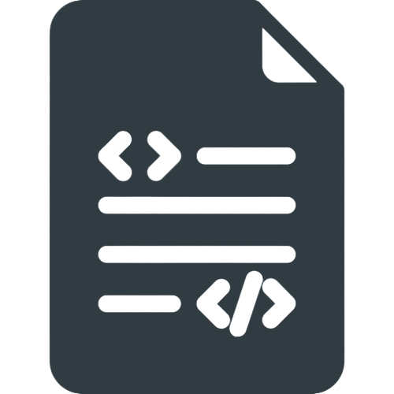

# **Build Your First Full Stack App With Flask**

Presented by Jeremie Bornais
Sample code available at:  
[github.com/jere-mie/flask-workshop](https://github.com/jere-mie/flask-workshop)

---


# A Little About Me

- Full Stack Software Developer at Assent
- Co-Founder of WinHacks and BorderHacks
- Former Research & Teaching assistant at UWindsor
- Former President of the UWindsor Computer Science Society
- Former Project Lead at GDSC
- 10+ Hackathon participant, mentor, speaker, organizer

[jeremie.bornais.ca](https://jeremie.bornais.ca)
[github.com/jere-mie](https://github.com/jere-mie)
[linkedin.com/in/jeremie-bornais](https://linkedin.com/in/jeremie-bornais)

---

# Agenda

1. About Flask
    - Overview of the framework, what it is, why you should use it
2. Installation
    - Simple step by step installation instructions
3. Your First App
    - The structure of a Flask app, and getting it up and running
4. Routes and Templates
    - Adding new routes to the app, rendering templates, inheriting from templates
5. Next Steps
    - SQLAlchemy, User Authentication, and other ways to extend your app
6. Interactive Demo

---


# **About Flask**

What it is and why you should use it

---

# What is Flask?

- A micro web framework written in Python
- Used for coding the back end of websites
- Very light by design
- Has many additional addons that can be used in addition to it (WTForms, SQLAlchemy, Flask-Login. etc.)

---

# Why use it?

- Very simple to get started
- Many great addons
- Hackathon-friendly
- Scales well
- More customizable, let's you decide how you want to solve certain problems

---


# **Installation**
Just a "pip install" away!

---

# "pip install flask"

- **Python 3.5+** is required to install Flask
- Pip must also be installed to be able to install it
- **Venv** is recommended to make handling libraries easier
- Simply run `pip install flask` to install it! 
- You may need to use `pip3` instead of `pip` if you're on a Linux or Unix system
- Link to download Python and pip: [python.org](https://python.org)

---


# **Your First App**
Boilerplate code to get you started

---

# The Bare Minimum

```py
from flask import Flask
app = Flask(__name__)

@app.route('/')
def hello_world():
    return 'Hello, World!'

if __name__ == "__main__":
    app.run(debug=True)
```

1. Save this file to **app.py**
2. Run `python app.py` (You may need to run `python3 app.py` instead)
3. Go to [http://127.0.0.1:5000/](http://127.0.0.1:5000/)

---

# Common structure of a Flask app

```
- app.py
- .env
- .gitignore
- static/
  - style.css
  - script.js
  - ...
- templates/
  - layout.html
  - home.html
  - ...
```

---


# **Routes and Templates**
Add pages, use real HTML files

---

# Common Functions

### render_template()
Used to render an HTML template file in the "templates" folder

### url_for()
Used to find the URL of a particular route, often used for links and specifying file sources (ex. css files)

### redirect()
Used to redirect the user to a different URL or route. Often used with `url_for()` to redirect to different routes on the website

---

# Your Own Routes

```py
@app.route('/about')
def about():
    return render_template('about.html')

@app.route('/contact')
def contact():
    return render_template('contact.html')
```

---

# Passing Data to Routes

```py
@app.route('/posts/<post_id>')
def posts(post_id):
    # do something with post_id
    post = get_post(post_id)
    return render_template('post.html', post=post)
```

## Linking this route with url_for():

```html
<a href="{{ url_for('posts', post_id=4) }}">View Post</a>
```

---

# Templates & Inheritance

In layout.html:

```html
<!DOCTYPE html>
<html>
 <head><title>Title</title></head>
  <body>
   
 </body>
</html>
```

In home.html:

```html


<h1>Hello World!</h1>

```

---

# More on Templates

Using a for loop:

```html

    <h3>{{ contact }}</h3>

```

Using an if statement:

```html

    <h3>Welcome User!</h3>

    <h3>You Must Login!</h3>

```

---



# **Next Steps**
Extending your app's functionality

---

# Common packages used with Flask

- Flask-SQLAlchemy
  - Simple extension that allows you to connect to a variety of SQL databases
- Flask-Login
  - Handles user sessions, makes authentication a breeze.
- Gunicorn
  - When used in conjunction with a reverse proxy (like caddy), allows for the easy deployment of the app.
- Flask-Uploads
  - Makes handling user file uploads simple and secure.
- bcrypt
  - Used for hashing and checking passwords, makes authentication more secure.

---


# **Interactive Demo**
Let's make something!

---


# **Questions?**
Ask away!

---

# **THANK YOU FOR JOINING!**

I hope you learned something new 😀
<br/>

Remember, the source code and these slides can be found here:
[github.com/jere-mie/flask-workshop](https://github.com/jere-mie/flask-workshop)

**Learn How To Host Your Flask App For Free Here:**
[blog.bornais.ca/posts/2023-10-18-gcp-caddy-tutorial](https://blog.bornais.ca/posts/2023-10-18-gcp-caddy-tutorial/)
